# Ducatus
Ducatus is a budgeting and financial management application for Android, built with Kotlin. It features recording of transactions, subscriptions, and loans, as well as managing your budget per month and even setting a goal and challenge. Tips are also available in articles and videos which can help your financial journey.

## Screenshots

    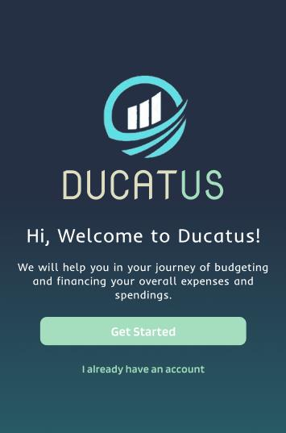
    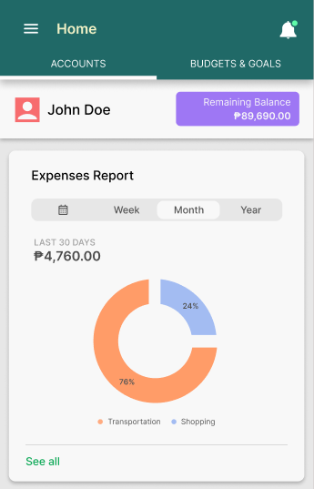

    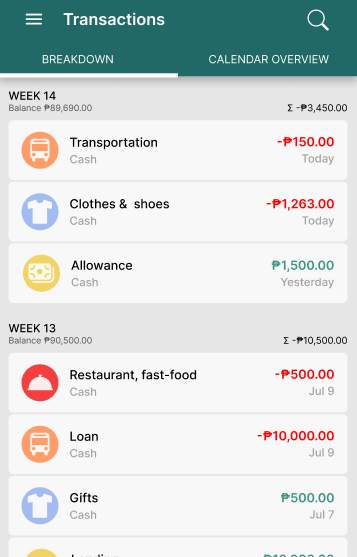
    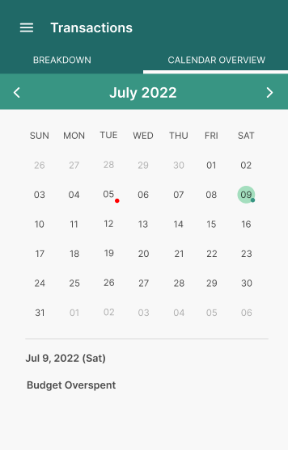
    
    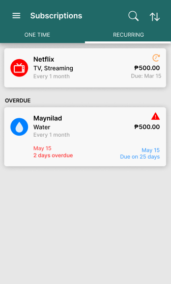

    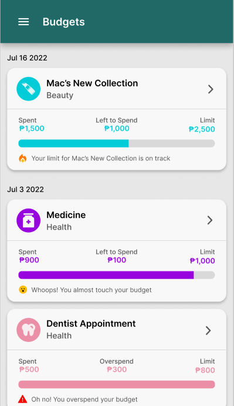
    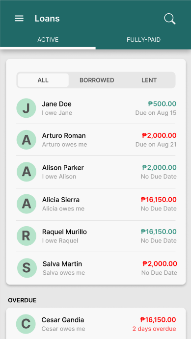
    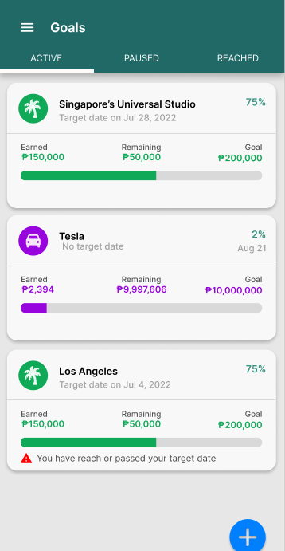
    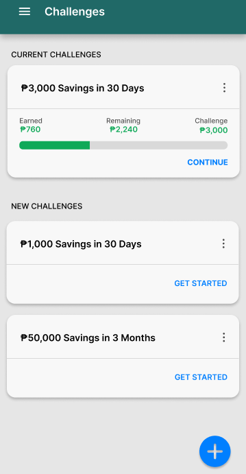

    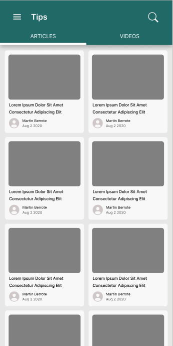
    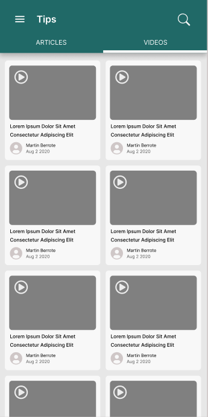

## Features

- Multiple accounts for each user
- Managing categories and subcategories (has built-in categories)
- Transaction management (income or expense) with receipt and image-to-text scanning
- Subscription management (one-time or recurring)
- Setting budgets for each category
- Loans management with due notifications
- Goal setting (can be wishlists)
- Challenges to save a set amount of money for a period of time
- Articles and videos for financial tips
